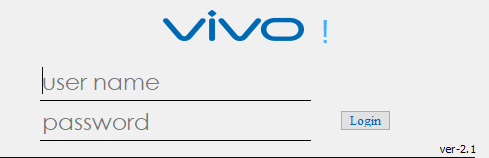

PyQt5 - Python Bindings for the Qt v5 Toolkit

COMMERCIAL VERSION

If you have the Commercial version of PyQt5 then you should also have a
license file that you downloaded separately.  The license file must be copied
to the "sip" directory before starting to build PyQt5.

## Login UI

 Login

